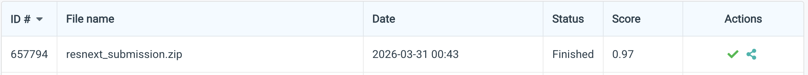

# NYCU Computer Vision 2026 HW1

**Student ID:** 111550133
**Name:** 蔡宇炫

## Introduction
This repository contains the implementation for the NYCU Computer Vision 2026 HW1: Image Classification Problem (100 categories). The objective is to maximize classification accuracy under a strict parameter limit (< 100M) and backbone constraint (ResNet-only). 

Our final model utilizes a modified ResNet backbone (ResNeXt-101_32x8d), which introduces grouped convolutions to standard residual blocks, effectively improving representation learning while remaining within the parameter limit (~88M). The model achieves a score of 0.97 on the CodaBench leaderboard. Additional techniques including Dropout regularization and Test-Time Augmentation (TTA) are implemented to further enhance robustness.

## Environment Setup
It is recommended to use Python 3.9 or higher. To reproduce the environment, please run the following commands:

```bash
conda create -n cv_hw1 python=3.9
conda activate cv_hw1
pip install -r requirements.txt
```

## Usage

### Training
To train the model from scratch (with pre-trained weights allowed):
```bash
python train.py
```

### Inference
To generate the `prediction.csv` file for submission:
```bash
python inference.py
```

## Performance Snapshot
 
