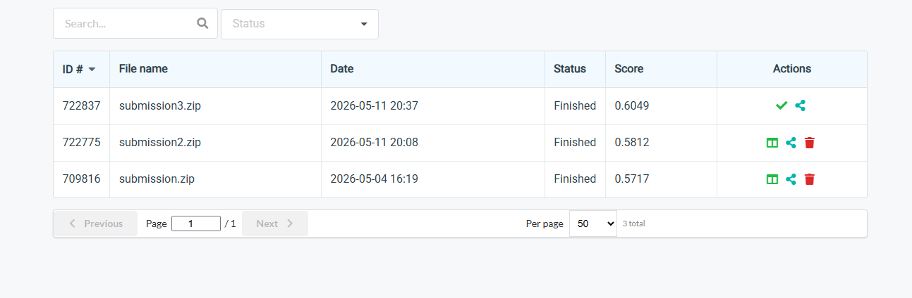
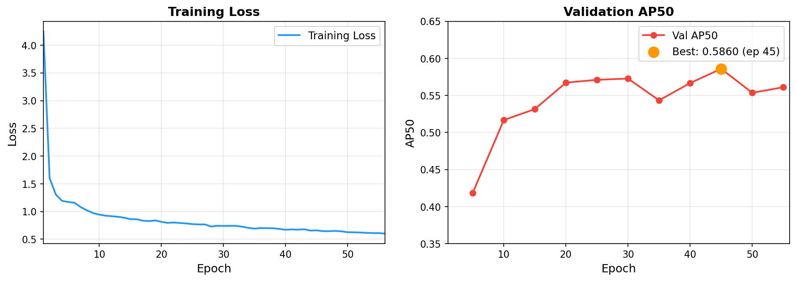

# HW3 — Instance Segmentation on Cell Microscopy Images

- **Student ID:** 111550133
- **Name:** 蔡宇炫

## Introduction

This project implements an instance segmentation pipeline for identifying and delineating four types of cells (class1–class4) in colored medical microscopy images. The model is based on **Mask R-CNN** with a **ResNet-101 + FPN** backbone, trained with custom small-scale anchors (8–128 px) suited to cell-size objects. Inference uses **Test-Time Augmentation** (8 views: 4 flips × 2 scales) merged with per-class NMS to improve AP50.

**Final public leaderboard score: AP50 = 0.6049**

## Environment Setup

```bash
pip install -r requirements.txt
```

Key dependencies: `torch >= 2.0`, `torchvision >= 0.15`, `tifffile`, `pycocotools`, `numpy`

## Usage

### Training

```bash
python train.py \
  --data-dir hw3-data-release/train \
  --epochs 50 \
  --batch-size 2 \
  --backbone resnet101 \
  --trainable-backbone-layers 4 \
  --lr 1e-4
```

### Inference (with TTA)

```bash
python inference.py \
  --checkpoint checkpoints/best.pth \
  --test-dir hw3-data-release/test_release \
  --test-json hw3-data-release/test_image_name_to_ids.json \
  --output test-results.json \
  --tta --scale-tta \
  --score-thresh 0.05 \
  --box-nms
```

## Performance Snapshot

| Configuration | AP50 (public leaderboard) |
|---|---|
| Baseline (score-thresh 0.5, no TTA) | 0.5717 |
| Lower threshold (0.3) + flip TTA | 0.5812 |
| **Lower threshold (0.05) + flip + scale TTA** | **0.6049** |

### Leaderboard




### Training Curve


