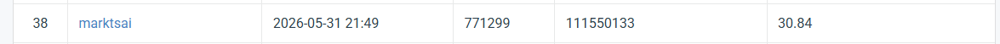
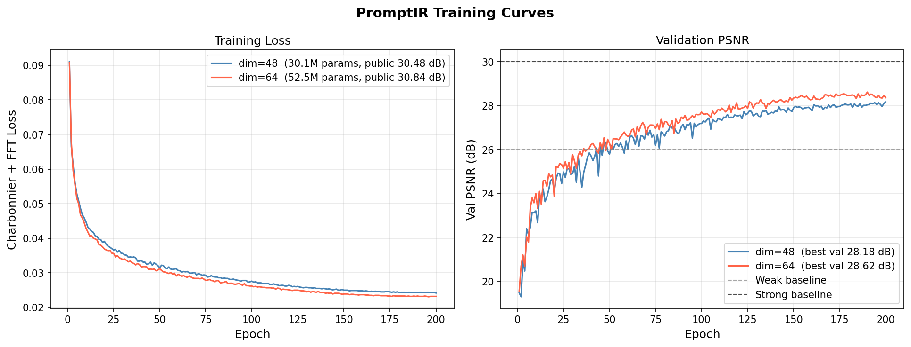

# NYCU Visual Recognition HW4 — Image Restoration

- **Student ID**: 111550133
- **Name**: 蔡宇炫

---

## Introduction

This repository implements **PromptIR** for all-in-one image restoration, targeting rain and snow removal using a single unified model. PromptIR injects learned degradation-specific prompts into the decoder at three scales, allowing the model to dynamically adapt its restoration behavior without explicit degradation labels.

Key modifications over vanilla PromptIR:
- **Combined Loss**: Charbonnier Loss + FFT frequency-domain L1 Loss (weight 0.1) to recover high-frequency texture details
- **Larger model**: dim=64, 52.5M parameters with 6 refinement blocks (vs. default dim=48, 30.1M)
- **Test-Time Augmentation (TTA)**: 8-fold augmentation (flips × rotations) at inference for +0.13 dB

---

## Environment Setup

```bash
# Create virtual environment
python -m venv venv
venv\Scripts\Activate.ps1      # Windows PowerShell
# source venv/bin/activate     # Linux/Mac

# Install dependencies
pip install -r requirements.txt

# For CUDA 12.8 (RTX 50 series / Blackwell)
pip uninstall torch torchvision -y
pip install torch torchvision --index-url https://download.pytorch.org/whl/cu128
```

Requirements: Python 3.9+, PyTorch 2.0+, CUDA recommended

---

## Usage

### Training

```bash
python train.py \
    --data_dir /path/to/hw4_realse_dataset \
    --epochs 200 \
    --batch_size 8 \
    --patch_size 128 \
    --lr 2e-4 \
    --dim 64 \
    --num_refinement_blocks 6 \
    --loss combined \
    --save_dir checkpoints
```

Resume from checkpoint:
```bash
python train.py --data_dir /path/to/dataset --resume checkpoints/last.pth
```

Fine-tune from a previous run (reset optimizer/scheduler):
```bash
python train.py --data_dir /path/to/dataset \
    --resume checkpoints/best.pth --finetune --lr 5e-5 --epochs 100
```

### Inference

```bash
python inference.py \
    --data_dir /path/to/hw4_realse_dataset \
    --checkpoint checkpoints/best.pth \
    --dim 64 \
    --num_refinement_blocks 6 \
    --tta \
    --output pred.npz
```

Then create the submission zip:
```bash
# Windows
Compress-Archive -Path pred.npz -DestinationPath submission.zip

# Linux/Mac
zip submission.zip pred.npz
```

Upload `submission.zip` to CodaBench. The file inside the zip **must** be named `pred.npz`.

### Generate Report Figures

```bash
# Training curves (requires train log files)
python plot_results.py

# Visual comparison (degraded / restored / clean)
python visualize.py \
    --data_dir /path/to/hw4_realse_dataset \
    --checkpoint checkpoints/best.pth \
    --dim 64 --num_refinement_blocks 6
```

---

## Performance Snapshot

| Model | Params | Val PSNR | Public PSNR |
|-------|--------|----------|-------------|
| PromptIR (dim=48) | 30.1M | 28.18 dB | 30.48 dB |
| PromptIR (dim=64) | 52.5M | 28.62 dB | **30.84 dB** |

Public leaderboard: **30.84 dB** (with 8× TTA), Rank 37




